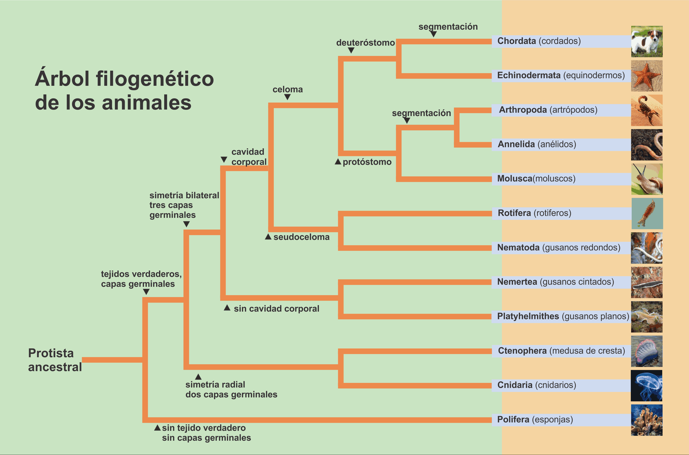

# expert-systems
Expert Systems university course repository

To run the server, you can use `gunicorn app:app`, it will take the port 8000

## Filos en los que se basa el proyecto

## some resources used for development

- [A tensorflow tutorial on basic classification with NN](https://www.tensorflow.org/tutorials/keras/classification?hl=es-419)

-![https://www.youtube.com/watch?v=U0ygkUmu7BA&t=169s]